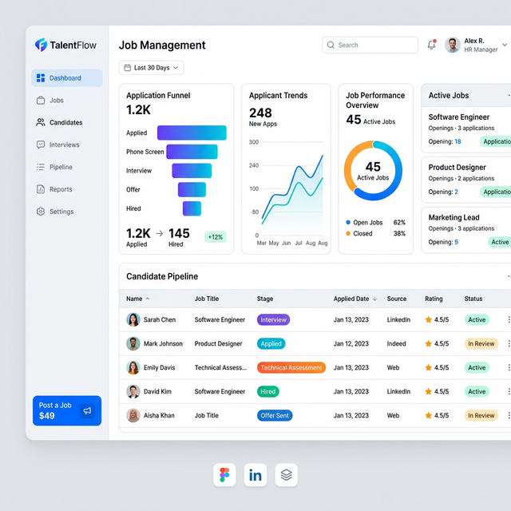

# QuickHire - Modern Job Search Platform

QuickHire is a premium, high-performance job board platform designed to connect talent with opportunities in the startup ecosystem. Built with a focus on speed, aesthetics, and user experience.



## 🚀 Key Features

### 🔍 Job Seekers
- **Dynamic Search & Filtering**: Real-time filtering by job title, company, and location.
- **Toggleable View Modes**: Switch between a curated **Grid View** and a professional **List View**.
- **Comprehensive Job Details**: Full job descriptions, requirements, and company insights.
- **Premium Application Form**: Seamless "Apply Now" modal with state management and real-time notifications.

### 🛠️ Admin Features
- **Centralized Dashboard**: Manage all job listings from a single, high-fidelity interface.
- **Post New Roles**: Interactive form to add new job openings with category, salary, and requirements.
- **Data Persistence**: Uses `localStorage` to ensure your listings are saved across sessions without a backend.
- **Easy Management**: Quick delete functionality with confirmation safety.

## 💻 Tech Stack

- **Framework**: [React.js](https://reactjs.org/)
- **Build Tool**: [Vite](https://vitejs.dev/)
- **Styling**: [Tailwind CSS](https://tailwindcss.com/)
- **Animations**: [Framer Motion](https://www.framer.com/motion/)
- **Icons**: [Lucide React](https://lucide.dev/)
- **Notifications**: [React Toastify](https://fnp.github.io/react-toastify/)
- **State Management**: React Context API

## 🛠️ Setup & Installation

Follow these steps to get the project running locally:

### 1. Prerequisites
- Node.js (v18+)
- Backend server running (default: `http://localhost:5000`)

### 1.2. Environment Setup
Create a `.env` file in the `frontend` directory and add:
```env
VITE_API_URL=http://localhost:5000/api
```

### 1.3. Clone the repository
```bash
git clone https://github.com/rayhan-hosen/taskproject.git
cd taskproject/frontend
```

### 2. Install dependencies
```bash
npm install
```

### 3. Start the development server
```bash
npm run dev
```

The application will be available at `http://localhost:5173/` (or the port specified in your terminal).

## 📂 Project Structure

```text
src/
├── assets/           # Media, images, and brand vectors
├── components/       # Reusable UI components
│   ├── common/       # Buttons, Cards, Inputs
│   ├── home/         # Hero, FeaturedJobs, Categories
│   └── layout/       # Navigation, Footer
├── context/          # React Context (JobContext.jsx)
├── data/             # Initial mock data (jobs.js)
├── pages/            # Main page components (Home, JobListings, Admin)
└── App.jsx           # Main routing and provider setup
```

## 📝 License

This project is open-source and available for everyone. Built for the QuickHire initiative.
